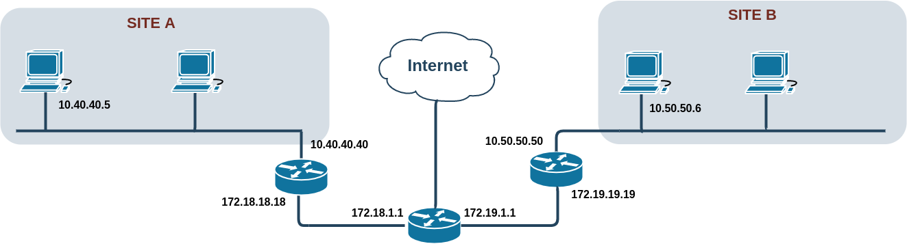

# Test bed for hole punching NATs

#### Tested with
- Vagrant (v 2.2.7)
	- box: "envimation/ubuntu-xenial"
- Virtualbox (v 6.1.4-2)
	- Networking mode of interfaces: "Internal networking" (intnet)
#### Name of hosts/VMs

- router
	- **eth1:** 172.18.1.1/16
	- **eth2:** 172.19.1.1/16
	- NAT:
		- iptables -t nat -A POSTROUTING -o eth0 -j MASQUERADE
- gw_a
	- **eth1:** 10.40.40.40/24
	- **eth2:** 172.18.18.18/16
	- NAT:
		- iptables --table nat --append POSTROUTING --out-interface eth2 -j MASQUERADE
		- iptables --table nat --append POSTROUTING --out-interface eth0 -j MASQUERADE
- node_a1
	- **eth1:** 10.40.40.5/24
- gw_b
	- **eth1:** 10.50.50.50/24
	- **eth2:** 172.19.19.19/16
	- NAT:
		- iptables --table nat --append POSTROUTING --out-interface eth2 -j MASQUERADE
		- iptables --table nat --append POSTROUTING --out-interface eth0 -j MASQUERADE	
- node_b1
	- **eth1:** 10.50.50.6/24
#### Run the test bed
	# Generate the base image
	cd boxes/base
	make base_vm
	# Run the test bed
	cd ../..
	vagrant up
	
To access the VMs, run:

	vagrant ssh [VMNAME]

#### TODO: 

- Add Google DNS to hosts

