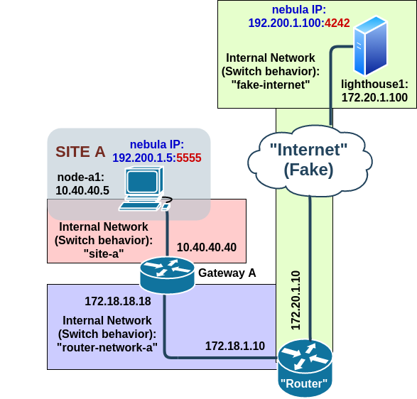

## Network with one (1) VPN Server and only one node


### Description

There is one VPN Sever called lighthouse1 that is connected to the router. Gateway A have a SNAT configured. Node a1 can reach the given VPN server.

#### Run the experiment

First you need to [install the ipsec box image](../boxes/README.md "install the base box image"), then proceed with:

	vagrant up
	
To access the VMs, run:

	vagrant ssh <lighthouse1|node_a1|gw_a|router|>

Run the following script in <lighthouse1> and <node-a1>

	ssh-keygen -b 2048 -t rsa -f /home/vagrant/.ssh/id_rsa -q -N ""

Now we need to copy the public key of node-a1 to the lighthouse

	vagrant ssh node_a1
	cd /home/vagrant/.ssh/
	ssh-copy-id -i id_rsa.pub vagrant@172.20.1.100

To run the Test scenario 3 we do, the results can be found in the results folder

	vagrant ssh node_a1
	cd ~/
	bash /vagrant/experiments/03_ipsec_delay/origin/03_ipsec_delay_experiment.sh

You can check the encapsulated packages in router with

	vagrant ssh router
	sudo tcpdump -i eth1  -vv -X


#### List of Virtual Machines
- router
- gw_a
- node_a1
- lighthouse1


#### Tested with
- GNU/Linux 4.14.171-1-MANJARO
- Vagrant (v 2.2.7)
	- box: "base_punch", [see the docs](../boxes/README.md "see the docs").
- Virtualbox (v 6.1.4-2)
	- Networking mode of interfaces: "Internal networking" (intnet)
- Strongswan

#### DEBUG: 
- On the "logs" folder/directory of this project you can find the (realtime) output of nebula with "debug" level of verbosity
- Check the NAT on the gateways A or B with
	- `sudo conntrack -E --src-nat`
- On "router"
	- `sudo tcpdump -i eth1 udp -vv -X`
	- `sudo tcpdump -i any -e -s 0 'net 172.0.0.0/8 and (udp or icmp) and not net 172.20.0.0/16 and not net 192.168.0.0/16'	`
- On "gw_a"
	- `sudo iptables -I OUTPUT -p icmp --icmp-type destination-unreachable -j DROP`
	- `sudo conntrack -L --src-nat`
- On "node_a1"
	- `echo -n "TESTING" | nc -u 172.20.1.100 4242`

#### TODO: 

- [ ] Todo

#### Name of hosts/VMs

#### router

- **eth0:** `192.168.111.15/24 "Fake Internet" (and also Vagrant mandatory interface) / Default Gateway`
- **eth1:** `172.18.1.1/16`
- **eth2:** `172.19.1.1/16`
- **eth3:** `172.20.1.10/16`
- NAT:
	- `iptables -t nat -A POSTROUTING -o eth0 -j MASQUERADE`
- Kernel IP routing table	
```
		Destination     Gateway         Genmask         Flags Metric Ref    Use Iface
		default         192.168.111.2   0.0.0.0         UG    0      0        0 eth0
		172.18.0.0      *               255.255.0.0     U     0      0        0 eth1
		172.19.0.0      *               255.255.0.0     U     0      0        0 eth2
		172.20.0.0      *               255.255.0.0     U     0      0        0 eth3
		192.168.111.0   *               255.255.255.0   U     0      0        0 eth0	
```

#### gw_a

- **eth0:** `192.168.112.15/24 Vagrant mandatory interface`
- **eth1:** `10.40.40.40/24`
- **eth2:** `172.18.18.18/16 Default Gateway`
- NAT:
	- `iptables --table nat --append POSTROUTING --out-interface eth2 -j SNAT --to-source 172.18.18.18`
- Kernel IP routing table
```	
		Destination     Gateway         Genmask         Flags Metric Ref    Use Iface
		default         172.18.1.10     0.0.0.0         UG    0      0        0 eth2
		10.40.40.0      *               255.255.255.0   U     0      0        0 eth1
		172.18.0.0      *               255.255.0.0     U     0      0        0 eth2
		192.168.112.0   *               255.255.255.0   U     0      0        0 eth0	
```		

#### node_a1

- **eth0:** `192.168.113.15/24 Vagrant mandatory interface`
- **eth1:** `10.40.40.5/24 Default Gateway`
- **nebula1:** `192.200.1.5/24 Virtual Interface for Nebula`
- Kernel IP routing table
```
		Destination     Gateway         Genmask         Flags Metric Ref    Use Iface
		default         10.40.40.40     0.0.0.0         UG    0      0        0 eth1
		10.40.40.0      *               255.255.255.0   U     0      0        0 eth1
		192.168.113.0   *               255.255.255.0   U     0      0        0 eth0
		192.200.1.0     *               255.255.255.0   U     0      0        0 nebula1
```		
