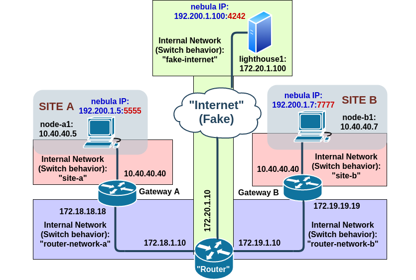

## Network with one (1) Nebula lighthouse and only one node from each side


### Description

There is one lighthouse (lighthouse1) that is connected to the router. Gateway A and B have a SNAT configured. **To this point, "node-a1" that belongs to the Site A can not reach "node-b1" that belong to Site B and viceversa.** The nodes can reach the Lighthouse without problems.

From the "node-a1" we try to ping "node-b1", no success.
```
vagrant@node-a1:~$ ping -c 10 192.200.1.7
PING 192.200.1.7 (192.200.1.7) 56(84) bytes of data.

--- 192.200.1.7 ping statistics ---
10 packets transmitted, 0 received, 100% packet loss, time 9027ms
```
Here the `conntrack -L --src-nat` of both gateways (Omit the IPs 192.168.115.15 and 192.168.113.15, they correspond to vagrant):
```
vagrant@gw-a:~$ sudo conntrack -L --src-nat
udp      17 28 src=10.40.40.5 dst=192.168.115.15 sport=5555 dport=7777 [UNREPLIED] src=192.168.115.15 dst=172.18.18.18 sport=7777 dport=5555 mark=0 use=1
udp      17 26 src=10.40.40.5 dst=172.19.19.19 sport=5555 dport=7777 [UNREPLIED] src=172.19.19.19 dst=172.18.18.18 sport=7777 dport=5555 mark=0 use=1
udp      17 167 src=10.40.40.5 dst=172.20.1.100 sport=5555 dport=4242 src=172.20.1.100 dst=172.18.18.18 sport=4242 dport=5555 [ASSURED] mark=0 use=1
conntrack v1.4.3 (conntrack-tools): 3 flow entries have been shown.

vagrant@gw-b:~$ sudo conntrack -L --src-nat
udp      17 19 src=10.40.40.7 dst=192.168.113.15 sport=7777 dport=5555 [UNREPLIED] src=192.168.113.15 dst=172.19.19.19 sport=5555 dport=1024 mark=0 use=1
udp      17 175 src=10.40.40.7 dst=172.20.1.100 sport=7777 dport=4242 src=172.20.1.100 dst=172.19.19.19 sport=4242 dport=7777 [ASSURED] mark=0 use=1
udp      17 19 src=10.40.40.7 dst=172.18.18.18 sport=7777 dport=5555 [UNREPLIED] src=172.18.18.18 dst=172.19.19.19 sport=5555 dport=1024 mark=0 use=1
conntrack v1.4.3 (conntrack-tools): 3 flow entries have been shown.
```

#### Run the test bed

First you need to [install the base box image](../boxes/README.md "install the base box image"), then proceed with:

	vagrant up
	
To access the VMs, run:

	vagrant ssh <lighthouse1|node_a1|gw_a|router|gw_b|node_b1|>

If you want to make changes on the Nebula setup (YAML files) without rebooting the entire VMs, you can do a 'make restart' and it would "restart" the Nebula 'daemons' on the nodes

>	`make restart`

#### List of Virtual Machines
- router
- gw_a
- node_a1
- gw_b
- node_b1


#### Tested with
- GNU/Linux 4.14.171-1-MANJARO
- Vagrant (v 2.2.7)
	- box: "base_punch", [see the docs](../boxes/README.md "see the docs").
- Virtualbox (v 6.1.4-2)
	- Networking mode of interfaces: "Internal networking" (intnet)
- Nebula v 1.2.0

#### DEBUG: 
- On the "logs" folder/directory of this project you can find the (realtime) output of nebula with "debug" level of verbosity
- Check the NAT on the gateways A or B with
	- `sudo conntrack -E --src-nat`
- On "router"
	- `sudo tcpdump -i eth1 udp -vv -X`
	- `sudo tcpdump -i any -e -s 0 'net 172.0.0.0/8 and (udp or icmp) and not net 172.20.0.0/16 and not net 192.168.0.0/16'	`
- On "gw_a"
	- `sudo iptables -I OUTPUT -p icmp --icmp-type destination-unreachable -j DROP`
	- `sudo conntrack -L --src-nat`
- On "node_a1"
	- `echo -n "TESTING" | nc -u 172.20.1.100 4242`

#### TODO: 

- [ ] Todo

#### Name of hosts/VMs

#### router

- **eth0:** `192.168.111.15/24 "Fake Internet" (and also Vagrant mandatory interface) / Default Gateway`
- **eth1:** `172.18.1.1/16`
- **eth2:** `172.19.1.1/16`
- **eth3:** `172.20.1.10/16`
- NAT:
	- `iptables -t nat -A POSTROUTING -o eth0 -j MASQUERADE`
- Kernel IP routing table	
```
		Destination     Gateway         Genmask         Flags Metric Ref    Use Iface
		default         192.168.111.2   0.0.0.0         UG    0      0        0 eth0
		172.18.0.0      *               255.255.0.0     U     0      0        0 eth1
		172.19.0.0      *               255.255.0.0     U     0      0        0 eth2
		172.20.0.0      *               255.255.0.0     U     0      0        0 eth3
		192.168.111.0   *               255.255.255.0   U     0      0        0 eth0	
```

#### gw_a

- **eth0:** `192.168.112.15/24 Vagrant mandatory interface`
- **eth1:** `10.40.40.40/24`
- **eth2:** `172.18.18.18/16 Default Gateway`
- NAT:
	- `iptables --table nat --append POSTROUTING --out-interface eth2 -j SNAT --to-source 172.18.18.18`
- Kernel IP routing table
```	
		Destination     Gateway         Genmask         Flags Metric Ref    Use Iface
		default         172.18.1.10     0.0.0.0         UG    0      0        0 eth2
		10.40.40.0      *               255.255.255.0   U     0      0        0 eth1
		172.18.0.0      *               255.255.0.0     U     0      0        0 eth2
		192.168.112.0   *               255.255.255.0   U     0      0        0 eth0	
```		

#### node_a1

- **eth0:** `192.168.113.15/24 Vagrant mandatory interface`
- **eth1:** `10.40.40.5/24 Default Gateway`
- **nebula1:** `192.200.1.5/24 Virtual Interface for Nebula`
- Kernel IP routing table
```
		Destination     Gateway         Genmask         Flags Metric Ref    Use Iface
		default         10.40.40.40     0.0.0.0         UG    0      0        0 eth1
		10.40.40.0      *               255.255.255.0   U     0      0        0 eth1
		192.168.113.0   *               255.255.255.0   U     0      0        0 eth0
		192.200.1.0     *               255.255.255.0   U     0      0        0 nebula1
```		

#### gw_b

- **eth0:** `192.168.114.15/24 Vagrant mandatory interface`
- **eth1:** `10.40.40.40/24`
- **eth2:** `172.19.19.19/16 Default Gateway`
- NAT:
	- `iptables --table nat --append POSTROUTING --out-interface eth2 -j SNAT --to-source 172.19.19.19`
- Kernel IP routing table		
```	
		Destination     Gateway         Genmask         Flags Metric Ref    Use Iface
		default         172.19.1.10     0.0.0.0         UG    0      0        0 eth2
		10.40.40.0      *               255.255.255.0   U     0      0        0 eth1
		172.19.0.0      *               255.255.0.0     U     0      0        0 eth2
		192.168.114.0   *               255.255.255.0   U     0      0        0 eth0
```

#### node_b1

- **eth0:** `192.168.115.15/24 Vagrant mandatory interface`
- **eth1:** `10.40.40.7/24 Default Gateway`
- **nebula1:** `192.200.1.7/24 Virtual Interface for Nebula`
- Kernel IP routing table
```	
		Destination     Gateway         Genmask         Flags Metric Ref    Use Iface
		default         10.40.40.40     0.0.0.0         UG    0      0        0 eth1
		10.40.40.0      *               255.255.255.0   U     0      0        0 eth1
		192.168.115.0   *               255.255.255.0   U     0      0        0 eth0
		192.200.1.0     *               255.255.255.0   U     0      0        0 nebula1
```
