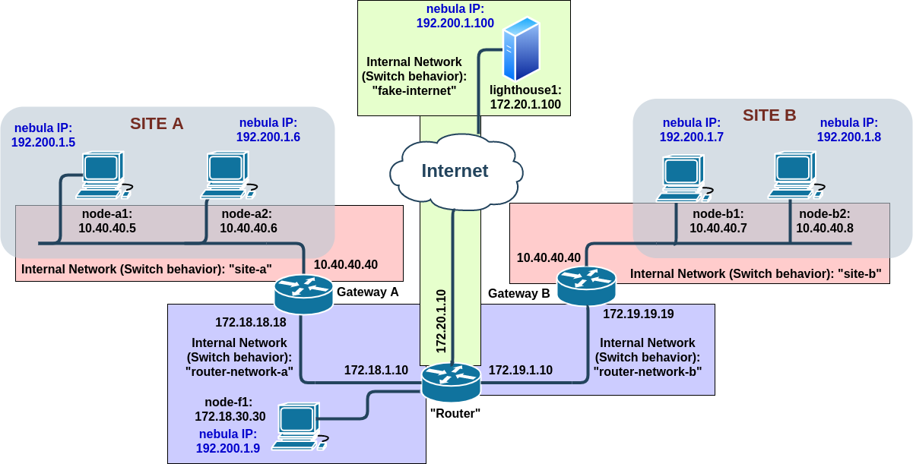

## Network with one (1) Nebula lighthouse

#### Tested with
- GNU/Linux 4.14.171-1-MANJARO
- Vagrant (v 2.2.7)
	- box: "base_punch", [see the docs](../boxes/README.md "see the docs").
- Virtualbox (v 6.1.4-2)
	- Networking mode of interfaces: "Internal networking" (intnet)
- Nebula v 1.1.0	
#### Name of hosts/VMs

- router
	- **eth0:** 192.168.111.15/24 "Fake Internet" (and also Vagrant mandatory interface) / Default Gateway
	- **eth1:** 172.18.1.1/16
	- **eth2:** 172.19.1.1/16
	- NAT:
		- iptables -t nat -A POSTROUTING -o eth0 -j MASQUERADE
	- Kernel IP routing table
>		Destination     Gateway         Genmask         Flags Metric Ref    Use Iface
>		default         192.168.111.2   0.0.0.0         UG    0      0        0 eth0
>		172.18.0.0      *               255.255.0.0     U     0      0        0 eth1
>		172.19.0.0      *               255.255.0.0     U     0      0        0 eth2
>		192.168.111.0   *               255.255.255.0   U     0      0        0 eth0	
- gw_a
	- **eth0:** 192.168.112.15/24 Vagrant mandatory interface
	- **eth1:** 10.40.40.40/24
	- **eth2:** 172.18.18.18/16 Default Gateway
	- NAT:
		- iptables --table nat --append POSTROUTING --out-interface eth2 -j SNAT --to-source 172.18.18.18
	- Kernel IP routing table
>		Destination     Gateway         Genmask         Flags Metric Ref    Use Iface
>		default         172.18.1.1      0.0.0.0         UG    0      0        0 eth2
>		10.40.40.0      *               255.255.255.0   U     0      0        0 eth1
>		172.18.0.0      *               255.255.0.0     U     0      0        0 eth2
>		192.168.112.0   *               255.255.255.0   U     0      0        0 eth0	
- node_a1
	- **eth0:** 192.168.113.15/24 Vagrant mandatory interface
	- **eth1:** 10.40.40.5/24 Default Gateway
	- Kernel IP routing table
>		Destination     Gateway         Genmask         Flags Metric Ref    Use Iface
>		default         10.40.40.40     0.0.0.0         UG    0      0        0 eth1
>		10.40.40.0      *               255.255.255.0   U     0      0        0 eth1
>		192.168.113.0   *               255.255.255.0   U     0      0        0 eth0
- node_a2

- gw_b
	- **eth0:** 192.168.114.15/24 Vagrant mandatory interface
	- **eth1:** 10.40.40.40/24
	- **eth2:** 172.19.19.19/16 Default Gateway
	- NAT:
		- iptables --table nat --append POSTROUTING --out-interface eth2 -j SNAT --to-source 172.19.19.19
	- Kernel IP routing table
>		Destination     Gateway         Genmask         Flags Metric Ref    Use Iface
>		default         172.19.1.1      0.0.0.0         UG    0      0        0 eth2
>		10.40.40.0      *               255.255.255.0   U     0      0        0 eth1
>		172.19.0.0      *               255.255.0.0     U     0      0        0 eth2
>		192.168.114.0   *               255.255.255.0   U     0      0        0 eth0
- node_b1
	- **eth0:** 192.168.115.15/24 Vagrant mandatory interface
	- **eth1:** 10.40.40.7/24 Default Gateway
	- Kernel IP routing table
>		Destination     Gateway         Genmask         Flags Metric Ref    Use Iface
>		default         10.40.40.40     0.0.0.0         UG    0      0        0 eth1
>		10.40.40.0      *               255.255.255.0   U     0      0        0 eth1
>		192.168.115.0   *               255.255.255.0   U     0      0        0 eth0
- node_b2

- node_f1

#### Run the test bed

	vagrant up
	
To access the VMs, run:

	vagrant ssh <lighthouse1|node_a1|node_a2|gw_a|router|gw_b|node_b1|node_b2|node_f1>

#### DEBUG: 
- On "router"
	- sudo tcpdump -i eth1 udp -vv -X
	- sudo tcpdump -i any -e -s 0 'net 172.0.0.0/8 and (udp or icmp) and not net 172.20.0.0/16 and not net 192.168.0.0/16'	
- On "gw_a"
	- sudo iptables -I OUTPUT -p icmp --icmp-type destination-unreachable -j DROP
	- sudo conntrack -L --src-nat
- On "node_b1"
	- echo -n "TEST" | nc -u 172.18.1.9 4242 -q 0
	- echo -n "TEST" | nc -u 172.18.1.9 4242 -q 0 -p 4243; echo -n "TEST2" | nc -u 172.18.1.7 4242 -q 0 -p 4243; echo -n "TEST3" | nc -u 172.18.1.8 4242 -q 0 -p 4243;
- On "node_a1"
	- echo -n "TESTING" | nc -u 172.20.1.100 4242

#### TODO: 

- [ ] Todo
