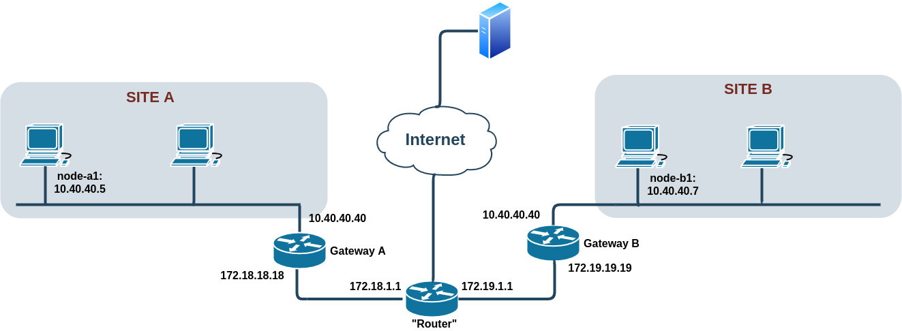

## Network with a simple NAT

#### Description
This is a simple network topology created with Vagrant and VirtualBox, there is a simple nat applied with iptables on the gateways and the router (the NAT in the router is debatable).
The nat applied (on gw_a, gw_b) is:

	iptables -t nat -A POSTROUTING -o ethX -j SNAT --to-source 172.1X.1X.1X
	
For exaxmaple, if you access **node-a1** (vagrant ssh node_a1) and you use ping/tracepath/traceroute to 172.19.19.19 you can see how you can reach that side of the network. However, node-b1 (10.40.40.7) is out of scope (as expected).

#### Run the test bed

	vagrant up
	
To access the VMs, run:

	vagrant ssh <node_a1|gw_a|router|gw_b|node_b1>

#### List of Virtual Machines
- router
- gw_a
- node_a1
- gw_b
- node_b1

#### Tested with
- GNU/Linux 4.14.171-1-MANJARO
- Vagrant (v 2.2.7)
	- box: "base_punch", [see the docs](../boxes/README.md "see the docs").
- Virtualbox (v 6.1.4-2)
	- Networking mode of interfaces: "Internal networking" (intnet), [Check Chapter 6 of VirtualBox manual](https://www.virtualbox.org/manual/ch06.html#network_internal)

#### DEBUG: 
- vagrant up --debug &> vagrant.log
- VBoxManage list --long intnets
- VBoxManage list --long runningvms
- VBoxManage list runningvms
- VBoxManage showvminfo <uuid|vmname> --machinereadable
- VBoxManage showvminfo <uuid|vmname> --details
- VBoxManage natnetwork list [<pattern>]
- vagrant vbguest base_punch  --status
- vagrant box list
- vagrant box remove <base-punch-nat|envimation/ubuntu-xenial>

#### TODO: 

- [ ] Add Google DNS to hosts
- [x] Check linked clones for Vagrant
- [x] For the default NAT interface of Vagrant, configure manually a different MAC and Space address
- [ ] Do we need promiscuous mode?
- [ ] Check if we need --natdnsproxy1 and --natdnsproxy1
- [ ] Try to loop the creationg process
- [x] Check vagrant-vbguest plugin for downloading the right VirtualBox Guest Additions
- [ ] Add references to documentation

#### Name of hosts/VMs

- router
	- **eth0:** 192.168.111.15/24 "Fake Internet" (and also Vagrant mandatory interface) / Default Gateway
	- **eth1:** 172.18.1.1/16
	- **eth2:** 172.19.1.1/16
	- NAT:
		- iptables -t nat -A POSTROUTING -o eth0 -j MASQUERADE
	- Kernel IP routing table
>		Destination     Gateway         Genmask         Flags Metric Ref    Use Iface
>		default         192.168.111.2   0.0.0.0         UG    0      0        0 eth0
>		172.18.0.0      *               255.255.0.0     U     0      0        0 eth1
>		172.19.0.0      *               255.255.0.0     U     0      0        0 eth2
>		192.168.111.0   *               255.255.255.0   U     0      0        0 eth0	
- gw_a
	- **eth0:** 192.168.112.15/24 Vagrant mandatory interface
	- **eth1:** 10.40.40.40/24
	- **eth2:** 172.18.18.18/16 Default Gateway
	- NAT:
		- iptables --table nat --append POSTROUTING --out-interface eth2 -j SNAT --to-source 172.18.18.18
	- Kernel IP routing table
>		Destination     Gateway         Genmask         Flags Metric Ref    Use Iface
>		default         172.18.1.1      0.0.0.0         UG    0      0        0 eth2
>		10.40.40.0      *               255.255.255.0   U     0      0        0 eth1
>		172.18.0.0      *               255.255.0.0     U     0      0        0 eth2
>		192.168.112.0   *               255.255.255.0   U     0      0        0 eth0	
- node_a1
	- **eth0:** 192.168.113.15/24 Vagrant mandatory interface
	- **eth1:** 10.40.40.5/24 Default Gateway
	- Kernel IP routing table
>		Destination     Gateway         Genmask         Flags Metric Ref    Use Iface
>		default         10.40.40.40     0.0.0.0         UG    0      0        0 eth1
>		10.40.40.0      *               255.255.255.0   U     0      0        0 eth1
>		192.168.113.0   *               255.255.255.0   U     0      0        0 eth0
- gw_b
	- **eth0:** 192.168.114.15/24 Vagrant mandatory interface
	- **eth1:** 10.40.40.40/24
	- **eth2:** 172.19.19.19/16 Default Gateway
	- NAT:
		- iptables --table nat --append POSTROUTING --out-interface eth2 -j SNAT --to-source 172.19.19.19
	- Kernel IP routing table
>		Destination     Gateway         Genmask         Flags Metric Ref    Use Iface
>		default         172.19.1.1      0.0.0.0         UG    0      0        0 eth2
>		10.40.40.0      *               255.255.255.0   U     0      0        0 eth1
>		172.19.0.0      *               255.255.0.0     U     0      0        0 eth2
>		192.168.114.0   *               255.255.255.0   U     0      0        0 eth0
- node_b1
	- **eth0:** 192.168.115.15/24 Vagrant mandatory interface
	- **eth1:** 10.40.40.7/24 Default Gateway
	- Kernel IP routing table
>		Destination     Gateway         Genmask         Flags Metric Ref    Use Iface
>		default         10.40.40.40     0.0.0.0         UG    0      0        0 eth1
>		10.40.40.0      *               255.255.255.0   U     0      0        0 eth1
>		192.168.115.0   *               255.255.255.0   U     0      0        0 eth0
